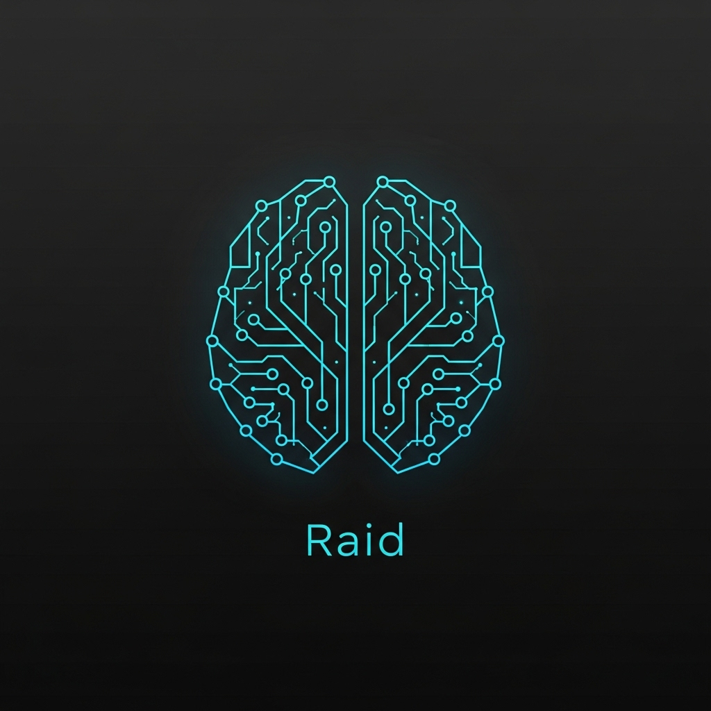

<p align="center">
  
</p>

**Raid** es un asistente de inteligencia artificial de escritorio diseñado para "ver" y entender lo que sucede en tu sistema operativo en tiempo real. Utilizando un enfoque de **Cerebro Híbrido**, Raid combina modelos de visión local con modelos de lenguaje avanzados para ofrecer una interacción fluida, natural y contextual en español.

## 🚀 Características Principales

- **Visión en Tiempo Real**: Capacidad para capturar y analizar la pantalla del usuario para responder preguntas sobre lo que está viendo (código, imágenes, videos, documentos).
- **Cerebro Híbrido**:
  - **Moondream 1.8b**: Especializado en análisis visual rápido.
  - **Llama 3.2 3b**: Orquesta la conversación en español con una personalidad amigable y profesional.
- **Memoria a Largo Plazo**: El sistema aprende de tus gustos, nombre y contexto de trabajo a través del tiempo, persistiendo los datos en un motor de memoria local.
- **Interfaz Premium**: Dashboard moderno basado en Glassmorphism con visualización de logs en vivo, estado del sistema y perfil del usuario.
- **Interacción por Voz**: Entrada de voz mediante Google Speech Recognition y salida de voz nativa de Windows (SAPI5) para latencia ultra baja.

## 🛠️ Requisitos

- **Ollama** instalado y corriendo.
- Modelos necesarios en Ollama:
  ```bash
  ollama pull moondream:1.8b
  ollama pull llama3.2:3b
  ```
- **Python 3.10+**
- Sistema Operativo: **Windows** (Optimizado para SAPI5).

## 📦 Instalación

1. Clona el repositorio:
   ```bash
   git clone https://github.com/Axel-the/Raid-local-ai.git
   cd raid
   ```

2. Crea un entorno virtual e instala las dependencias:
   ```bash
   python -m venv .venv
   source .venv/Scripts/activate  # En Windows
   pip install -r requirements.txt
   ```

## 🎮 Uso

Para iniciar el asistente con la interfaz gráfica:

```bash
python asistente_gui.py
```

Luego abre tu navegador en: `http://127.0.0.1:5000`

### Comandos de Voz:
- Simplemente habla después de que el sistema diga "Listening...".
- Pregúntale sobre lo que ves en pantalla: *"¿Qué me puedes decir de este código?"* o *"¿Quién es el personaje de esta imagen?"*.
- Raid aprenderá tu nombre e intereses conforme interactúes con él.

## 🧠 Arquitectura del Sistema

La magia de Raid reside en su flujo de procesamiento:
1. **Escucha**: Captura de audio y conversión a texto.
2. **Observa**: Captura de pantalla silenciosa al detectar el comando.
3. **Analiza**: Moondream traduce la imagen a una descripción textual detallada.
4. **Razona**: Llama 3.2 combina el prompt del usuario, la descripción visual y la memoria histórica.
5. **Responde**: Streaming de texto a la UI y síntesis de voz inmediata.

## 📄 Licencia

Este proyecto está bajo la licencia MIT.

---
Desarrollado con ❤️ para la comunidad de IA Local.
